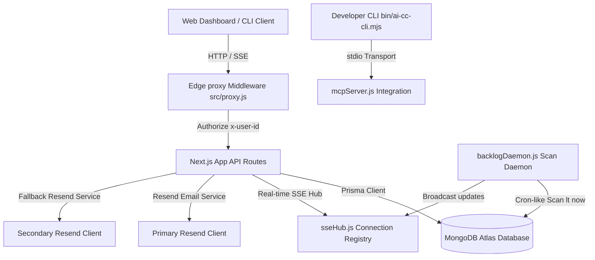

# Cadence — AI Command Center & Workspace Orchestrator

Cadence is a developer-focused, multi-tenant workspace management orchestrator. It is built as a premium full-stack Next.js 16 application with an Edge proxy network, MongoDB Atlas database integration (backed by Prisma), Server-Sent Events (SSE) for real-time board updates, a background task backlog scanner daemon, a checkboxes-based Discord-style permissions override grid, and a dual-domain Resend email notification service. 

It also bundles a **Developer CLI** and an **IDE-compatible Model Context Protocol (MCP) Server** to bridge your local developer context directly with the cloud dashboard.

---

## 🏗️ Project Architecture & Design



### 1. Core Architecture Components
* **Next.js 16 App Router (Turbopack)**: Handles routing, static compilation, and API routes. The frontend is styled using a custom monochromatic dark slate theme with micro-animations.
* **Edge Proxy Handler (`src/proxy.js`)**: An edge-compatible JWT parser and router. It extracts tokens from the `Authorization: Bearer <token>` header, cookies, or query parameters, and passes user authentication info (`x-user-id`, `x-user-email`, `x-user-access`) downstream.
* **Database Layer (`prisma/schema.prisma`)**: Integrated with MongoDB Atlas. Powered by Prisma Client singleton mapping in `src/lib/db.js`.
* **SSE Connection Registry (`src/lib/sseHub.js`)**: An in-memory real-time registry keeping track of active user connections. It handles pings, broadcasts task updates to organizations, and sends instant notifications.
* **Backlog Scan Daemon (`src/lib/backlogDaemon.js`)**: A background daemon that scans for overdue tasks (where `dueDate < now` and status is not `COMPLETED`/`BACKLOG`), transitions them to `BACKLOG`, and broadcasts real-time board updates via SSE.
* **Resend Email Service (`src/lib/email.js`)**: A production-grade emailing script modeled with 2-domain fallback. If sending via the primary domain fails or is unconfigured, it automatically retries using the secondary fallback credentials.

---

## 🗄️ Database Models & Relationships

The database is built on MongoDB and mapped using the following Prisma schemas:

### Models Summary
1. **User**: Represents a registered user. Holds platform system access privileges (`SystemAccess`: `USER`, `ADMIN`, `SUPER_ADMIN`).
2. **Organisation**: Multi-tenant workspace units. Contains departments and members.
3. **OrgMember**: Resolves the membership relation between `User` and `Organisation`. Sets organizational roles (`OrgRole`: `PRESIDENT`, `DIRECTOR`, `MEMBER`) and handles Discord-style explicit permission override strings.
4. **Department**: Functional teams within an organisation (e.g. Frontend, Backend).
5. **DeptMember**: Maps department memberships and roles (`DeptRole`: `MANAGER`, `MEMBER`).
6. **Task**: Represents tasks assigned to department members. Lifecycle statuses include `BACKLOG`, `TODO`, `IN_PROGRESS`, and `COMPLETED`.
7. **ApiToken**: Holds hashed API tokens created by users for CLI or MCP server bindings.

### Standard Roles & Permissions System
Permissions checks are centralized in `src/lib/permissions.js` using:
* **Global Access Overrides**: `SUPER_ADMIN` and `ADMIN` users bypass all local organization/department locks.
* **Org PRESIDENT**: Inherits all permissions within their organization.
* **Org DIRECTOR**: Inherits standard editing and management capabilities (`ORG_EDIT`, `ORG_MANAGE_ROLES`, `DEPT_CREATE`, `DEPT_EDIT`, `TASK_CREATE`, `TASK_EDIT`, `TASK_ASSIGN`, `TASK_UPDATE`).
* **Discord-Style Overrides**: Arbitrary custom overrides (e.g. `TASK_CREATE`) can be directly granted to standard `MEMBER` accounts. The system enforces that no member can grant permissions they do not possess.

---

## 📁 Project Structure

```
├── bin
│   └── ai-cc-cli.mjs             # Developer CLI entrypoint
├── prisma
│   └── schema.prisma             # MongoDB Prisma models
├── src
│   ├── app
│   │   ├── admin                 # Platform Admin Panels
│   │   │   ├── users             # Users management route
│   │   │   └── workspaces        # Workspaces management route
│   │   ├── api                   # REST API routes
│   │   │   ├── admin             # Super Admin endpoints
│   │   │   ├── auth              # Google/Register/Login APIs
│   │   │   ├── orgs              # Workspaces, Departments, Join & Member APIs
│   │   │   ├── realtime          # SSE Stream API
│   │   │   └── tasks             # Kanban Task & Accept APIs
│   │   ├── dashboard             # User dashboard page
│   │   ├── login                 # styled Login view
│   │   ├── register              # styled Register view
│   │   ├── globals.css           # Minimalist monochromatic theme styling
│   │   ├── layout.js             # Meta definitions & font assets
│   │   └── page.js               # Landing view
│   ├── components
│   │   ├── CommandMenu.js        # Ctrl+K global command search
│   │   └── KanbanBoard.js        # Drag-and-drop Kanban task columns
│   ├── lib
│   │   ├── apiErrors.js          # API Error & standard response helpers
│   │   ├── auth.js               # Hashing (PBKDF2) & JWT utility
│   │   ├── backlogDaemon.js      # Overdue scan loop
│   │   ├── db.js                 # Prisma db client singleton cache
│   │   ├── email.js              # Resend email handler with fallback
│   │   ├── mcpServer.js          # Model Context Protocol server logic
│   │   ├── permissions.js        # Hierarchical permission checking
│   │   ├── sseHub.js             # SSE connection hub registry
│   │   └── proxy.js              # Edge-proxy routing handler
└── package.json                  # Next.js scripts & dependencies
```

---

## 📡 REST API Map

All routes are prefixed with `/api` and require a valid JWT token via `Authorization: Bearer <token>` (except public auth paths).

### Authentication
* `POST /api/auth/register`: Create a new user account.
* `POST /api/auth/login`: Authenticate with password and receive a JWT.
* `POST /api/auth/google`: OAuth exchange verifying Google identity credentials.

### Organisations & Workspaces
* `GET /api/orgs`: Retrieve workspaces that the authenticated user is an explicit member of.
* `POST /api/orgs`: Create a new workspace organization (creator becomes `PRESIDENT`).
* `GET /api/orgs/discover`: Discover available workspaces on the platform that the user has not yet joined.
* `GET /api/orgs/[id]`: Retrieve workspace details, member lists, and departments.
* `PUT /api/orgs/[id]`: Update workspace name or description.
* `DELETE /api/orgs/[id]`: Cascade delete the workspace.
* `POST /api/orgs/[id]/join`: Join a workspace as a `MEMBER` (notifies President via Resend).
* `POST /api/orgs/[id]/members`: Invite a registered user by email (sends Resend invite).
* `PUT /api/orgs/[id]/members`: Update role and permission overrides.

### Departments
* `GET /api/orgs/[id]/departments`: List departments inside a workspace.
* `POST /api/orgs/[id]/departments`: Create a new department.

### Tasks
* `GET /api/tasks`: List tasks filtered by `organisationId` or `departmentId`.
* `POST /api/tasks`: Create and publish a task (emails assignee if assigned).
* `PATCH /api/tasks/[taskId]`: Update task details, status, or assignee.
* `POST /api/tasks/[taskId]/accept`: Accept an assigned task, moving status to `IN_PROGRESS` (assignee only).

### Real-Time & Streams
* `GET /api/realtime/stream?token=<token>`: Open Server-Sent Events (SSE) keep-alive streaming channel.

### Platform Administration (Admins/Super Admins only)
* `GET /api/admin/users`: List all platform accounts.
* `PATCH /api/admin/users/[userId]`: Update platform system access levels.
* `GET /api/admin/orgs`: List all workspace organisations.

---

## 🛠️ Local Developer Setup

### Prerequisites
* **Node.js**: v18.x or v20.x
* **MongoDB**: A running MongoDB Atlas instance or local MongoDB instance

### Step 1: Install Dependencies
```bash
git clone https://github.com/Krishna-Das20/Cadence.git
cd Cadence
npm install
```

### Step 2: Configure Environment Variables
Create a `.env` file in the root directory:
```env
# Database
DATABASE_URL="mongodb+srv://<username>:<password>@cluster.mongodb.net/AICommandCenter?retryWrites=true&w=majority"

# Security
JWT_SECRET="super-secret-developer-command-center-token-key-2026"

# Port (matches Google OAuth allowed origins)
PORT=5173

# Google OAuth
NEXT_PUBLIC_GOOGLE_CLIENT_ID="753552498060-lfnd23mossrkji8dg313ivese96j1670.apps.googleusercontent.com"

# Resend Primary domain
RESEND_API_KEY="re_primary_resend_key"
EMAIL_FROM="Your App <noreply@yourdomain.com>"

# Resend Secondary fallback domain (optional)
RESEND_API_KEY_2="re_fallback_resend_key"
EMAIL_FROM_2="Your App Support <noreply@yourfallback.com>"

# App Public URL
NEXT_PUBLIC_APP_URL="http://localhost:5173"
```

### Step 3: Initialize Database Schema
Generate the Prisma Client and synchronize models with your MongoDB collection:
```bash
npx prisma generate
npx prisma db push
```

### Step 4: Run Development Server
```bash
npm run dev
```
Open [http://localhost:5173](http://localhost:5173) in your browser.

### Step 5: Verify Production Compile
Before shipping, verify Next.js builds cleanly:
```bash
npm run build
```

---

## 💻 Developer CLI & MCP Integration

Cadence features a built-in CLI to bind terminal context and run an IDE-compatible Model Context Protocol (MCP) server.

### 1. Local CLI Login Redirection
To link your CLI terminal session with your web dashboard account:
1. Open your terminal in the project directory.
2. Run:
   ```bash
   npm run cli login
   ```
   This spins up a local HTTP listener on port `8989`.
3. In your web dashboard, click **Authorize CLI** (under local IDE settings). The dashboard redirects your JWT token back to the local CLI port, saving it inside a local `.ai-cc-token` configuration file.

### 2. Connect the MCP Server
To configure your IDE (e.g. Cursor, VS Code, or Claude Desktop) to parse and manage your tasks directly, connect the stdio transport channel.

#### Configuration Example (Claude Desktop Config)
Add this configuration snippet inside your Claude Desktop configuration file:
* Windows: `%APPDATA%\Claude\claude_desktop_config.json`
* macOS/Linux: `~/Library/Application Support/Claude/claude_desktop_config.json`

```json
{
  "mcpServers": {
    "cadence-tasks": {
      "command": "node",
      "args": ["C:/Users/KIIT/Downloads/FED/AI Command Center/bin/ai-cc-cli.mjs", "start-mcp"],
      "env": {
        "DATABASE_URL": "mongodb+srv://...",
        "JWT_SECRET": "super-secret-developer-command-center-token-key-2026"
      }
    }
  }
}
```

### 3. Exposed MCP Tools
Your LLM assistant gains access to the following tools:
* **`list_assigned_tasks`**: List all active tasks assigned to the user bound to the CLI token.
* **`accept_task`**: Accepts a task by its ID, transitioning status to `IN_PROGRESS` and setting `acceptedAt` timestamps.
* **`update_task_status`**: Transitions task status to `TODO`, `IN_PROGRESS`, `COMPLETED`, or `BACKLOG`. Updates completed timestamps and broadcasts changes.

---

## 🚀 Deploying to Vercel

Ensure you set all required environment variables in the Vercel dashboard.

1. Install the Vercel CLI or run:
   ```bash
   npx vercel --prod --yes
   ```
2. Verify all API bindings and real-time SSE stream events load securely on your custom vercel deployment domains.
